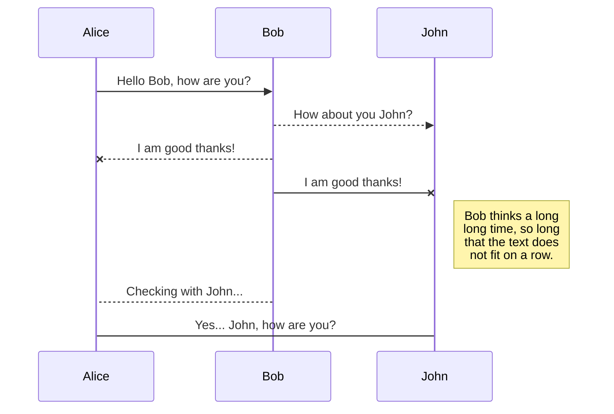
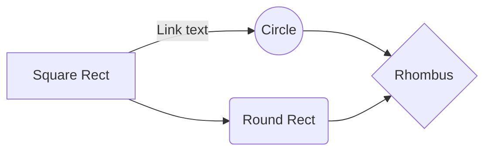

# Welcome to MyStudy!
## Category
- [UnrealEngine](/UnrealEngine/)
- [C,C++](/C,C++/)
- [C#](/C%23/)
- [Unity](/Unity/)
- [English](/English/)
- [Regex](/Regex)
- [OS Architecture](/OS_Architecture)
- [Misc](/Misc)
- [Github](/Github/)

## UML diagrams

You can render UML diagrams using [Mermaid](https://mermaidjs.github.io/). For example, this will produce a sequence diagram:

And this will produce a flow chart:

